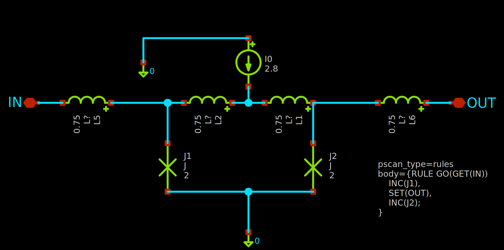
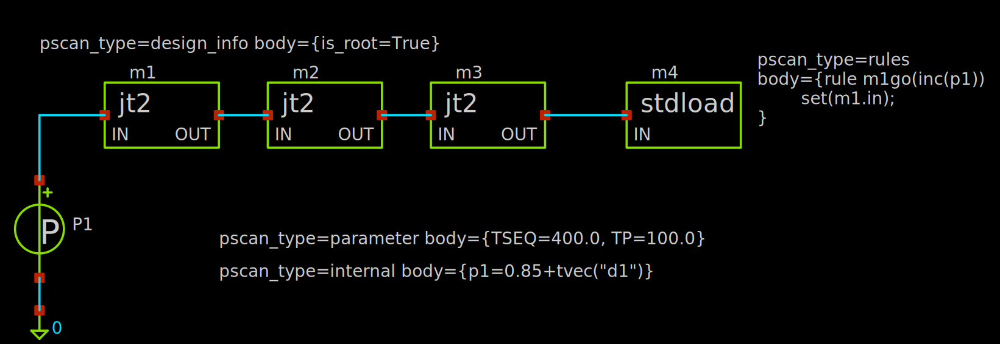

# pscan2_xschem

This is a basic XSCHEM library package to get started with simulating with PSCAN2. 

## What is PSCAN2?

PSCAN2 is a superconductor circuit simulator that can be downloaded from [www.pscan2sim.org](http://www.pscan2sim.org). It supports a set of device models (Josephson junction, inductance, resistance, current source, phase source) used in superconducting circuits. It expects as input a SPICE-style netlist (.CIR) and separate HDL files containing device values and SFQHDL rules.  

## What is XSCHEM?

XSCHEM ([xschem.sourceforge.io/stefan/index.html](https://xschem.sourceforge.io/stefan/index.html)) is a schematic capture program that supports hiearchical circuits. 

## What is pscan2_xschem for?
**pscan2_xschem** provides a basic set of XSCHEM symbols and scripts that allows the user to generate netlists that can be directly simulated by PSCAN2. The included symbols are _jj_, _ind_, _res_, _isrc_, and _psrc_.

## Requirements
* XSCHEM
* PSCAN2
* Python 

## Installation
Unzip folder into `[pscan2_xschem path]`

Add the line below to the xschemrc file in the project directory: 

`source [pscan2_xschem path]/xschemrc`

or add the line to the user-specific xschemrc at ~/.xschem/xschemrc

Note that the project-specific xschemrc (if any) takes precedence over the user-specific xschemrc.

## How to use pscan2_xschem?

PSCAN2 symbols provided by pscan2_xschem can be inserted into the schematic. The typical design flow involves creating subckt cells, with corresponding symbols, that can be instantiated in higher-level schematic for simulation. 

### Example: Josephson Transmission Line (jt2)

Below is an example for a Josephson Transmission Line (JTL) cell (jt2.sch), with two JJs. The SFQHDL rules embedded in the schematic as a text element with a specific format detected by the HDL generator script.   



``` 
pscan_type=rules 
body={RULE GO(GET(IN))
    INC(J1),
    SET(OUT),
    INC(J2);
}
```

The corresponding HDL file (jt2.hdl) generated is
```
circuit jt2()
{

PARAMETER
        L1=0.75,
        L2=0.75,
        I0=2.8,
        L5=0.75,
        L6=0.75,
        J1=2.01,
        J2=2.01;

EXTERNAL
        XL1=1,
        XL2=1,
        XI0=1,
        XL5=1,
        XL6=1,
        XJ1=1,
        XJ2=1;

        RULE GO(GET(IN))
    INC(J1),
    SET(OUT),
    INC(J2);
}
```

### Example: JTL testbench (jt2tb)

The schematic below for instantiates the jt2 cell mentioned above together with a phase source and a terminating load cell. The gnd and iopin device symbols come from `xschem_library/devices`  



Here additional text elements are detected by the HDL generator. The resulting HDL file generated is
```
PARAMETER
        XI=1, XJ=1, XL=1, XR=1,TSEQ=400.0, TP=100.0;

circuit jt2tb()
{

INTERNAL
        p1=0.85+tvec("d1");

        rule m1go(inc(p1))
        set(m1.in);

}
```
The HDL generator automatically writes the global variable initializations (XI, XJ, XL, XR) and adds to it the embedded text element `pscan_type=parameter body={TSEQ=400.0, TP=100.0}`. There is also a text element for INTERNAL variables as in `pscan_type=internal body={p1=0.85+tvec("d1")}`.

#### jt2tb netlist
```
** sch_path: /home/user/pscan2_xschem/examples/jt2tb/jt2tb.sch
**.subckt jt2tb
Xm1 net1 net2 jt2
P1 net1 0 P1
Xm2 net2 net3 jt2
Xm3 net3 net4 jt2
Xm4 net4 stdload
**.ends
* expanding   symbol:  jt2.sym # of pins=2
** sym_path: /home/user/pscan2_xschem/cells/jt2.sym
** sch_path: /home/user/pscan2_xschem/cells/jt2.sch
.subckt jt2 IN OUT
*.iopin OUT
*.iopin IN
L1 net3 net2 L?
L2 net2 net1 L?
I0 0 net2 I?
L5 net1 IN L?
L6 OUT net3 L?
J1 net1 0 J
J2 net3 0 J
.ends
* expanding   symbol:  stdload.sym # of pins=1
** sym_path: /home/user/pscan2_xschem/cells/stdload.sym
** sch_path: /home/user/pscan2_xschem/cells/stdload.sch
.subckt stdload IN
*.iopin IN
Xm1 IN net1 jt2
R1 net2 0 R?
Xm2 net1 net2 jt2
.ends
.end
```

### PSCAN2 menu
A _PSCAN2_ menu is added to the XSCHEM interface with the following options:
* Set PSCAN2 sim directory
    * Select the directory where the netlist and HDL files will be written to. The default directory is `simulation` under the current working directory.
* Write HDL (full hierarchy)
    * Write all the HDL files for all the cells in the hierarchy of the current schematic.
* Write HDL (current schematic)
    * Write the HDL only for the current schematic.
* Write PSCAN2 Netlist (.CIR)
    * XSCHEM generates a .SPICE netlist in the the PSCAN2 simulation directory.
    * .CIR netlist (with blank lines removed) also generated for use by PSCAN2.


